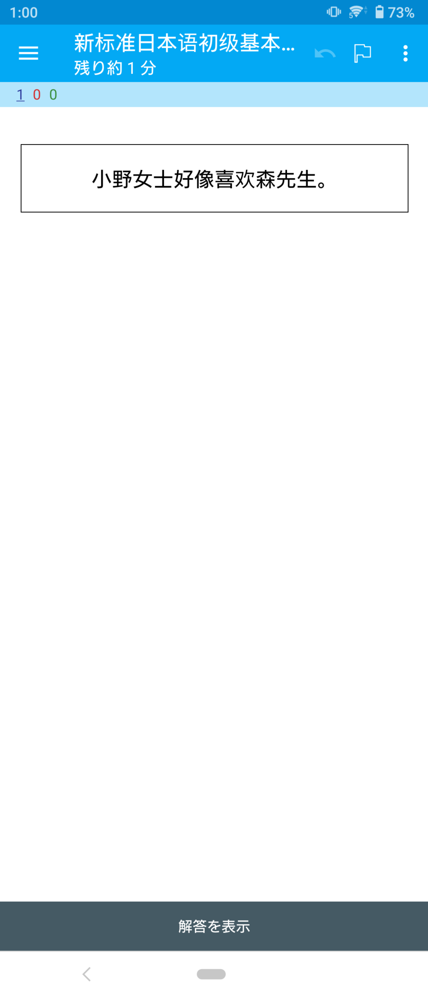
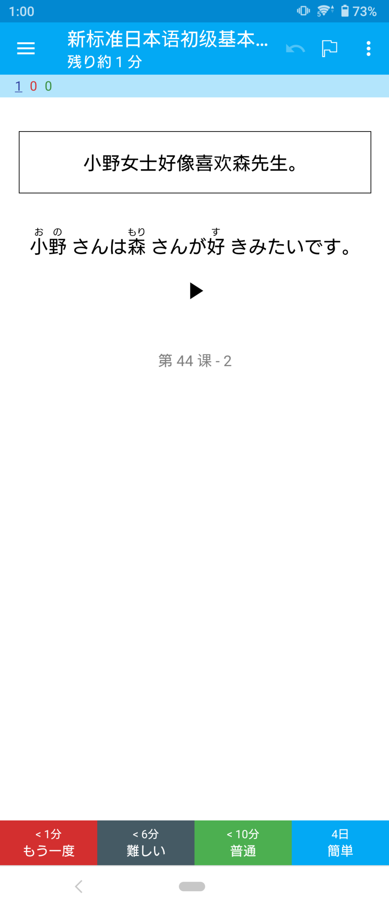

# anki-biaori

《新标准日本语》初级基本课文 Anki 卡组。

卡片正面为中文翻译，背面为日文课文并带日语发音。

[AnkiWeb 页面](https://ankiweb.net/shared/info/662072724)

或下载：[biaori-book1-basic.apkg](https://github.com/ytyt-yt/anki-biaori/releases/download/v1.0.0/biaori-book1-basic.apkg)

### Pre<ruby>view<rt>剧透</rt></ruby>

Front | Back
:---:|:---:
 | 

部分代码参考自：[breeswish/biaori-to-anki.js](https://gist.github.com/breeswish/807218232c3b8f3dd012bd3205692139) （[《新标准日本语》单词本目录](https://zhuanlan.zhihu.com/p/58139619)）

### Code

使用 [furigana](https://github.com/MikimotoH/furigana) （需要稍作魔改不然会报 Error）生成注音假名，并手动更改了标注错误的地方（[64efd3b](https://github.com/ytyt-yt/anki-biaori/commit/64efd3b8b1ff0b50f9a5946c5222427446c1c421)）。如发现仍有错误，欢迎提交 issue / PR。

如想自行运行，

1. 请购买正版教材下载官方APP后提取数据文件复制至 `./data/`, 如`./data/book1/`。

2. 运行 [biaori.py](biaori.py) 后会得到 [output/book1-basic.txt](output/book1-basic.txt) 和音频文件 `ouput/audio/*.mp3`。

3. 运行 [scripts/finecut.py](scripts/finecut.py) 会对音频进行进一步剪辑（除去开头标号空白等）。音频文件保存在`ouput/audio-finecut/*.mp3`。

4. 手动校准 txt 文件（见[History for output/book1-basic.txt](https://github.com/ytyt-yt/anki-biaori/commits/master/output/book1-basic.txt)）后，根据 [Anki Manual](https://docs.ankiweb.net/importing.html) 导入 `txt` 和 `mp3` 文件进 Anki。

#### Misc
内容版权归教材出版商所有，卡组仅供个人学习使用。
